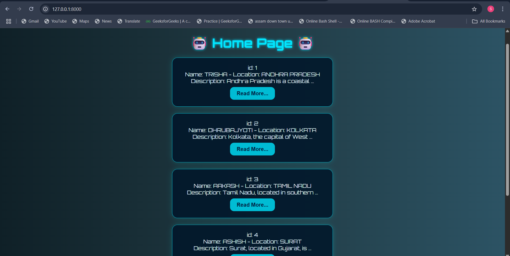

# Django Mini Project 01

Hi! I'm Sukanya and this is my **first Django project**!  
Today, I learned about Django templating, URL routing, and views.

---

##  What I Built

A mini web app that displays trainer data using:

- Django templates with `for` loops and filters
- URL routing (`home` and `read` pages)
- Static files for a **cool blue robotic UI** 

---

## 📸 Output Screenshot

---

##  Tech Stack

- Django 5.2
- HTML, CSS (custom)
- Python

---

##  What’s Next?

This is just the beginning — I’ll be building more mini Django projects as I keep learning. Stay tuned!

---

## 🤖 Author

**Sukanya Ghosh**  
[GitHub Profile](https://github.com/SukanyaGhosh6)
